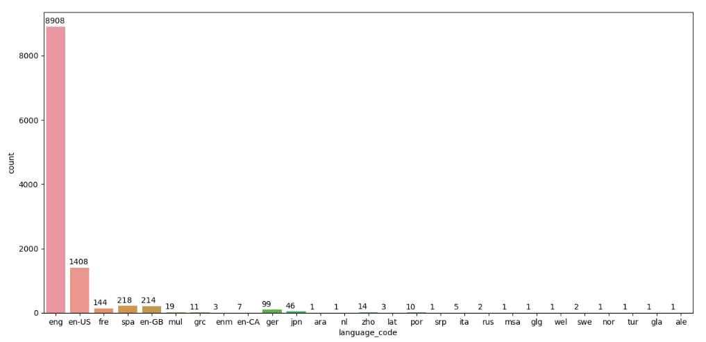
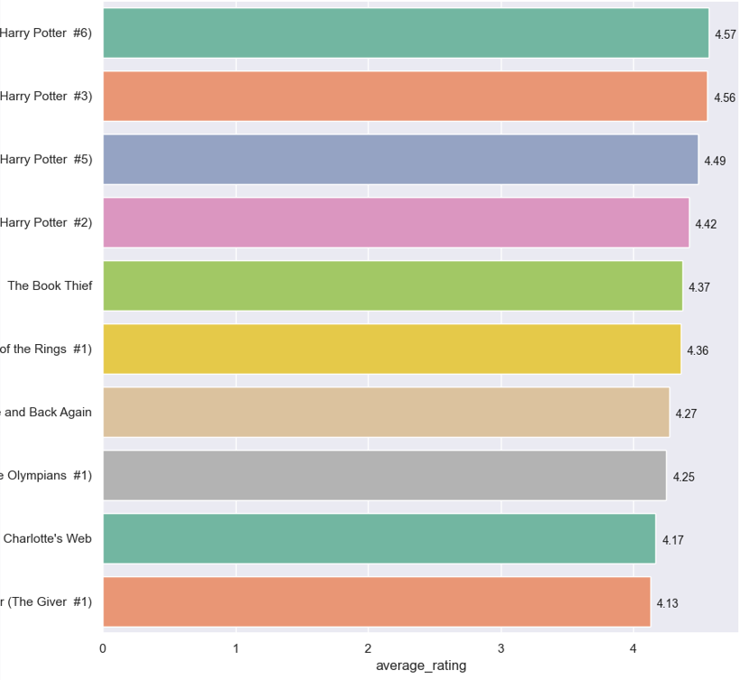
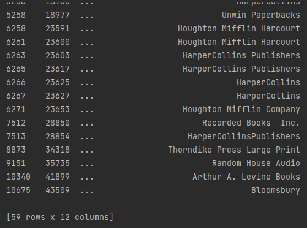

Overskrift

Kort introduktion

Libraries brugt

Find antal af bøger i forskellige landekoder :<br/>


lav nyt dataframe kun med engelske landekode bøger
````python
Kode eksempel
````

vælg top 10 bedst bedømte engelske bøger :<br/>


find alle bøger med engelsk sprog lavet af J.K Rowling og/eller J.R.R Tolkien :<br/>
Måske lidt kode eksempel her <br/>
````python
Kode eksempel
````


Find ud af hvem der har lavet flest bøger ?

find ud af hvem der har bedste ratings gennemsnit ?

Mere?