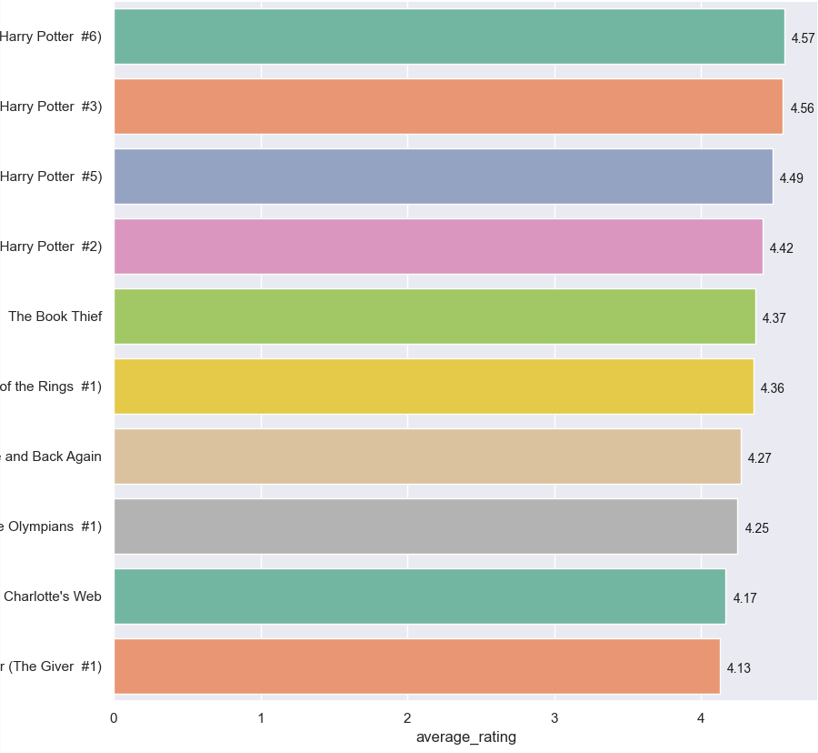

## Analyse af bøger med python

1. [Introduktion](#introduktion)
2. [Libraries](#libraries)
3. [Landekoder](#landekoder)
4. [Landekoder](#Bedst bed)


### Introduktion
Introduktion

### Libraries
Libraries

### Landekoder
Landekoder

Find antal af bøger i forskellige landekoder :<br/>


lav nyt dataframe kun med bøger som har 'eng' landekode.
````python
Kode eksempel
````

vælg top 10 bedst bedømte engelske bøger :<br/>


find alle bøger med engelsk sprog lavet af J.K Rowling og/eller J.R.R Tolkien :<br/>
Måske lidt kode eksempel her <br/>
````python
Kode eksempel
````


Find ud af hvem der har lavet flest bøger ?

find ud af hvem der har bedste ratings gennemsnit ?

Mere?

Pointers: !
Heatmap
coallationer? 
hvilken rating burde en bog have, hvis lavet af en bestemt forfatter?
