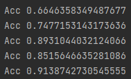

## Analyse af GoodReads-Books med python

1. [Introduktion](#introduktion)
2. [Libraries](#libraries)
3. [Landekoder](#landekoder)
4. [Top 10 bedst bedømte bøger](#top-10-bedst-bedømte-bøger)
5. [Data baseret på specifikke forfattere](#data-baseret-på-specifikke-forfattere)
6. [Prediction](#prediction)
   1. [Heatmap](#heatmap)
   2. [Linear-Model RidgeClassifier](#linear-Model-ridgeClassifier)
   2. [Trænet prediction med 50 procent test data](#trænet-prediction-med-50-procent-test-data)
7. [Konklusion](#konklusion)
   1. [Kunne problemet løses bedre uden ML](#kunne-problemet-løses-bedre-uden-ML)
   2. [Er problemet for komplekst](#er-problemet-for-komplekst)
   3. [Hvordan kunne man forbedre modellen](#hvordan-kunne-man-forbedre-modellen)
8. [Kilder](#kilder)


### Introduktion
"Casen" går ud på at analysere data fra et dataset ved brug af python.<br/>
Datasættet jeg har valgt, hedder "GoodReads Books" og her fra vil jeg ved brug af nogle python libraries finde frem til resultaterne som fremgår i dokumentationen herunder.

Opgaven er en del af de afsluttende afleveringer i machine learning faget på H4.

### Libraries
Libraries jeg har brugt i casen er :<br/>
<ul>
    <li>sklearn</li>
    <li>matplotlib.pyplot</li>
    <li>seaborn</li>
    <li>pandas</li>
    <li>numpy</li>
</ul>

### Landekoder
Først ligger jeg mærke til at der i datasettet fremgår flere sproglag, de er beskrevet som landekoder.<br/>
Først vil jeg finde frem til hvor mange bøger der egentlig opstår med landekoderne 'eng' og 'en-US', da det er disse bøger som er relevante for mig.

Countplot diagram over antallet af bøger i diverse landekoder :<br/>
<br/>

Herefter vil jeg gerne have de specifikke bøger med landekoderne 'eng' og 'en-US' ud i et nyt dataframe som jeg kan benytte fremadrettet :
````python
eng_books_df = raw_df[(raw_df['language_code'] == 'eng') | (raw_df['language_code'] == 'en-US')]
````

### Top 10 bedst bedømte bøger

Herefter vil jeg gerne se top 10 af de bedst bedømte engelske bøger i datasettet.

Barplot diagram over de 10 bedst bedømte engelske bøger i datasettet :<br/>


### Data baseret på specifikke forfattere

Herfter ligger jeg mærke til at der er to forfattere som jeg gerne vil se data omkring, og gerne kun fra disse to forfattere.<br/>
Derfor finder jeg alle bøger med engelsk sprog lavet af J.K Rowling og/eller J.R.R Tolkien :<br/>
````python
tolkien_Rowling_rows = eng_books_df["authors"].str.contains("J.R.R. Tolkien|J.K. Rowling")
tolkien_Rowling_df = eng_books_df[tolkien_Rowling_rows]
````


### Prediction

#### Heatmap
For at finde collaborations har jeg lavet et heatmap over colonner i datasettet som indeholder relevant information :<br/>
<br/>

Dog giver det kun mening at tage udgangspunkt i data som har en collaboration over ca. 50<br/>
Derfor har jeg valgt at tage udgangspunkt i text_review_count -> Ratings_count :<br/>
<br/>

#### Linear-Model RidgeClassifier
Jeg benytter Linear-Model RidgeClassifier fra Sklearn som er en del af supervised learning kategorien, <br/>
pointen ved at benytte denne, er at classifieren konverterer outcome til en værdi mellem -1 og 1. <br/>
Derefter håndteres resten som Regression model, som undersøger sammenhængen mellem ratings_count og vores text_reviews_count :

```python
predict = "ratings_count"

x = np.array(df_with_drops.drop([predict], axis=1))
y = np.array(eng_books_df['ratings_count'])

for _ in range(100):
    x_train, x_test, y_train, y_test = sklearn.model_selection.train_test_split(x, y, test_size=0.5)
    ridge = linear_model.RidgeClassifier()

    # Trains model
    ridge.fit(x_train, y_train)

    acc = ridge.score(x_test, y_test)
    print('Acc {0}'.format(acc))
```

#### Trænet prediction med 50 procent test data

Ved at træne modellen med 50% test data kan jeg presse min model helt op over 90% prediction success :<br>



### Konklusion

#### Kunne problemet løses bedre uden ML

Ud fra diverse grafer jeg er kommet frem til i casen, mener jeg absolut at det er brugbart inden for denne slags data. <br/>
Dog mener jeg ikke at selve prediction af antallet af bedømmelser ud fra antallet af text baserede anmeldelser giver mening. <br/>
Det har udelukkende været for at benytte algoritmen i projektet.

Antallet af bedømmelser vil selvfølgelig stige hvis antallet af tekstbaserede anmeldelser stiger, det behøves der ikke en algoritme for at forudse.<br/>
Vil dog mene at der kunne benyttes algoritme til at forudse om antallet af tekst baserede anmeldelser for eksempel i fleste tilfælde opstår ved negative anmeldelser. <br/>
På den måde vil man blandt andet kunne forude som anemdelser oftest opstår som negativ eller positiv, eller hvor vidt en bestemt genre<br/>
af bøger, får flere anmeldelser baseret på målgruppen, alder, køn osv. og hvorvidt den målgruppe hendvender sig oftest negativt eller positivt. <br/>
Det er der dog langt fra nok data til at anlysere på i dette datasæt.

#### Er problemet for komplekst

Problemerne som jeg har opstillet i mit projekt vil højest sandsynligt vurderes for nemme, da datasettet udelukkende er valgt for at kunnne komme omrking <br/>
en bred vifte af grafer samt data udtræk. Efter at have været igennem "casen", vil jeg have foretrukket andet valg af dataset, evt. med mere brugbart data <br/>
inden for prediction eller brug af andre algoritmer, da "collaboration" i dette datasæt ikke egnede sig til særligt mange algortimer, ud fra min overbevisning.

#### Hvordan kunne man forbedre modellen

Udover at træne modellen bedre, eller med mere data for at opnå højere forudsigelsesprocent, er jeg ikke helt klar over hvad der egentlig skal til <br/>
for at forbedre denne model, det vil sikkert kræve bedre data eller en helt anden model for at komme i mål med et både præcist og brugbart resultat.

### Kilder
En del af de steder jeg har fundet hjælp, inspiration og materiale er linket herunder :<br/><br/>
https://www.kaggle.com/datasets/jealousleopard/goodreadsbooks <br/>
https://www.kaggle.com/code/hoshi7/goodreads-analysis-and-recommending-books <br/>
https://www.kaggle.com/code/listonlt/books-data-visualisation-with-seaborn <br/>
https://www.kaggle.com/code/snanilim/book-recommendation-engine <br/>
https://www.machinelearningplus.com/pandas/how-to-create-pandas-dataframe-python/ <br/>
https://stackoverflow.com/questions/53911663/what-does-sklearn-ridgeclassifier-do
